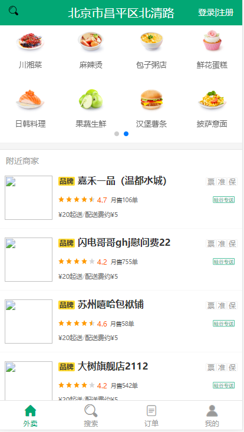
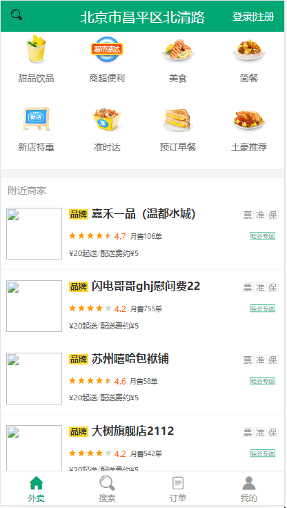
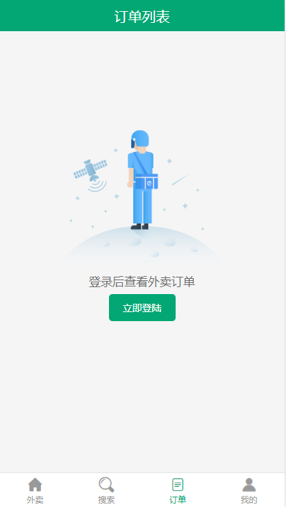

## 说明
前后端都有，功能齐全，中仿美团外卖移动app。

> 如果对您对此项目有兴趣，可以点 "Star" 支持一下 谢谢！🙏

> 或者您可以 "follow" 一下，我会不断开源更多的有趣的项目 👻

> 如有问题请直接在 Issues 中提，或者您发现问题并有非常好的解决方案，欢迎 PR 💯

> 开发环境: window10专业版; nodejs v12.13.1; vsCode

> 更多探索：[vue4-gshop后端项目](https://github.com/lumengxin/vue4-gshop-server.git)    [react简易版boss直聘](https://github.com/lumengxin/vue-pc-shop.git)

> 推荐指数：⭐⭐⭐⭐

### 技术栈

前端：vue全家桶 + vue-lazyload + @better-scroll/core + mint-ui + mockjs + swiper + moment
后端：axios + blueimp-md5 + body-parser + cookie-parser + ejs + mongoose + svg-captcha

### 项目运行
后端：
```
git clone https://github.com/lumengxin/vue4-gshop-server.git;
npm i;
npm start;
```
前端：
```
git clone https://github.com/lumengxin/vue4-gshop.git
npm install
npm run dev                 // 运行
npm run build               // 打包上线
```

## 项目预览：

[在线演示](http://www.byooka.com/v19/vue4-gshop)

**效果展示：**

<div style="display:flex;flex-wrap:wrap;">
    
    
    
    
</div>

